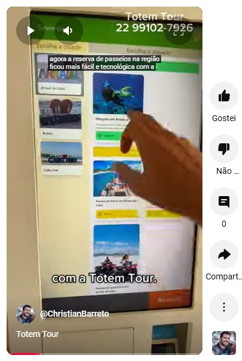

# Totem Tour App
The web based software for smart payment kiosks.

(click on the picture above to watch the movie)

## 1. Installing tools
`npm install -g firebase-tools`

## 2. Functions `(cd /functions)`
### 2.1 Install dependencies
`npm install`

### 2.2 Add .env files
(ask me the keys)

### 2.3 Login on firebase
`firebase login`

### 2.3 Run application
`npm run serve`

## 3. UI
### 3.1 Install dependencies
`npm install`

### 2.2 Run application
`npm start`